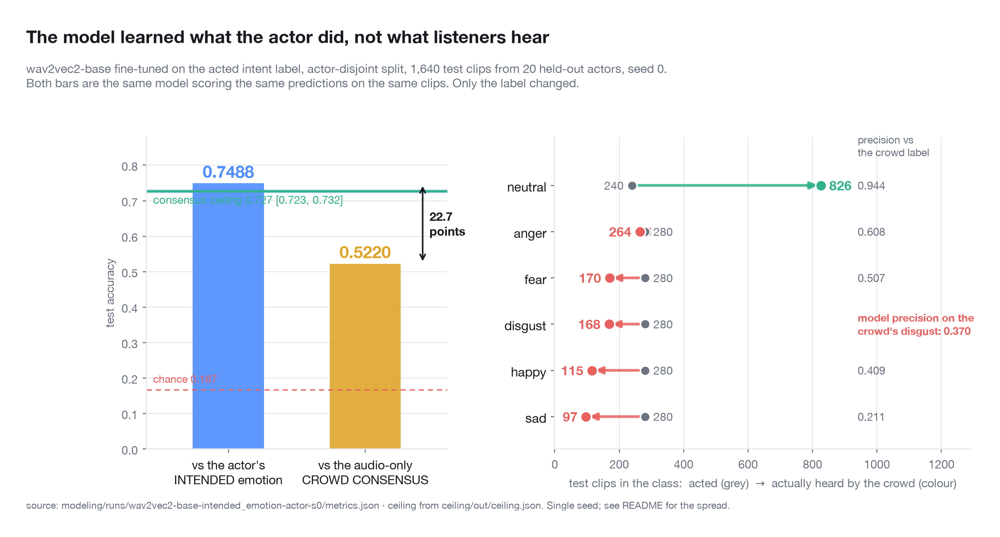
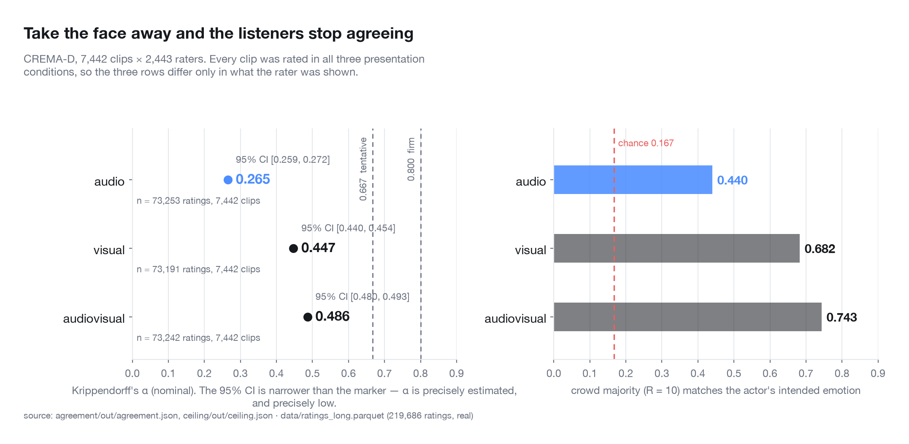
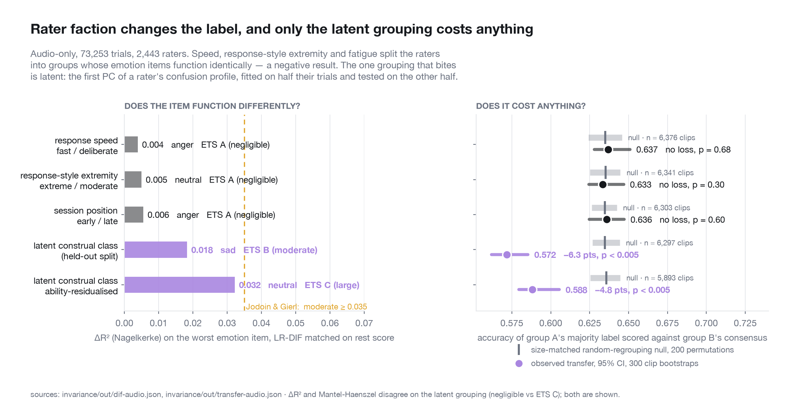

# emotion-label-ceiling

**One wav2vec2 fine-tune, one set of predictions, 1,640 held-out clips: 74.9% accurate
against the emotion the actor was told to perform, 52.2% against what listeners actually
heard. Same model, same audio, same predictions — 22.7 points of the result is nothing but
the choice of label.**

**And the listeners' own label has a ceiling. On audio-only CREMA-D, no model can exceed
72.7% (95% CI 72.3–73.2, n = 7,442 clips, 2,443 raters, median 10 raters per clip) against
the crowd consensus. Four published speaker-independent results sit above it: 76.75, 74.50,
73.83 and 73.34. Eleven of the thirteen modelling papers checked state no label target at
all, and the twelfth uses both without saying which one its headline number is scored
against.**

---

## The fine-tune

`facebook/wav2vec2-base` + mean pool + linear head, trained on the **actor's intended
emotion**, split by actor so no speaker appears on two sides: 60 actors train, 11 validate,
20 test. 8 epochs, MPS, seed 0. Then the same predictions on the same 1,640 test clips are
scored twice, once against each of CREMA-D's two labels.

<picture>
  <source media="(prefers-color-scheme: dark)" srcset="figures/03-intent-vs-heard-dark.png">
  
</picture>

| | value |
|---|---|
| test accuracy vs the actor's **intended** emotion | **0.7488** |
| test accuracy vs the **audio-only crowd consensus** | **0.5220** |
| gap | **22.7 points** |
| best validation accuracy (vs intended) | 0.7422 |
| test clips / held-out actors / seed | 1,640 / 20 / 0 |
| audio consensus ceiling, for comparison | 0.727 [0.723, 0.732] |
| headroom left to that ceiling | 0.205 |

**The model does not cross the ceiling.** 0.522 is 20.5 points *below* 0.727. That matters
for the argument in the other half of this repo: an honestly-built model that is genuinely
good at the acted task lands nowhere near the consensus bound, which makes four published
numbers sitting *above* that bound sharper, not weaker. Nothing here says the ceiling is
easy to reach.

### The classes are not the same classes

The split is not uniform. Score against intent and the six classes are near-balanced by
construction — 280 test clips each, 240 for neutral. Score against what the crowd heard from
the same audio and the corpus reorganises itself:

| class | clips, acted | clips, heard by the crowd | model precision vs the crowd label |
|---|---|---|---|
| neutral | 240 | **826** | 0.944 |
| anger | 280 | 264 | 0.608 |
| fear | 280 | 170 | 0.507 |
| disgust | 280 | **168** | **0.370** |
| happy | 280 | 115 | 0.409 |
| sad | 280 | **97** | 0.211 |

Half of the test set (50.4%) is *heard* as neutral where 14.6% was *performed* as neutral.
The model's precision on crowd-labelled disgust is 0.370: when it calls a clip disgust —
because the actor was performing disgust, and it learned to detect that — listeners heard
disgust less than two times in five. On crowd-labelled sad it is 0.211.

Read the other way, the one thing the model is precise about against the crowd label is
neutral (0.944), and it is precise there because neutral is what a crowd falls back on when
a voice carries no unambiguous signal. Its *recall* on crowd-neutral is only 0.344 — it does
not say neutral often, because it was trained on a label where neutral is one class in six.

This is the same result the annotation statistics show from the other end. **From voice
alone the crowd majority reproduces the actor's intent on 44.0% of clips and disagrees on
54.8%**, and for sad, happy, fear and disgust the plurality audio-only response is
*neutral*, not the intended emotion. A model trained on intent learns what the actor **did**
with their voice. That is a real, learnable acoustic thing. It is not what listeners
**hear**.

**Stated up front: this is one seed.** See [Limitations](#limitations).

---

## What CREMA-D is, and why it is the optimistic case

7,442 clips. 91 actors, each reading 12 fixed sentences, each **directed to portray**
one of six emotions: anger, disgust, fear, happy, neutral, sad. 2,443 crowd raters,
~90 clips each, forced choice among the same six. Every rater saw all three
presentation conditions — audio-only, visual-only, audiovisual — about 30 clips each.
219,686 ratings total.

Two things follow.

**This is acted emotion, so it is the easy case.** The actor knew what they were
performing. There is a recorded intended label. Spontaneous affect has no such
ground truth and is harder in every respect. Whatever ceiling shows up here is
generous relative to real speech.

**There are two different labels in this dataset and papers rarely say which they
used.** The filename encodes the intended emotion; `summaryTable.csv` ships separate
crowd majority votes. The distinction decides whether a reliability ceiling applies
at all — and, as the fine-tune above shows, it is worth 22.7 points.

The audio itself was pulled from an unofficial GitLab mirror, so it was checked against
`github.com/CheyneyComputerScience/CREMA-D` rather than trusted: **all 7,442 git-lfs sha256
digests match, and so do the sha256s of the 7,442 files actually on disk.** The mirror is
missing `processedResults/` and carries one extra video file, neither of which is used here.
Full check in [`data/README.md`](data/README.md).

## What the raters actually agree on

<picture>
  <source media="(prefers-color-scheme: dark)" srcset="figures/01-modality-agreement-dark.png">
  
</picture>

Computed here, per modality, n = 7,442 clips:

| | audio | visual | audiovisual |
|---|---|---|---|
| Krippendorff's α (nominal) | **0.265** [0.259, 0.272] | 0.447 [0.440, 0.454] | 0.486 [0.480, 0.493] |
| Pairwise agreement between two raters | 0.455 | 0.546 | 0.579 |
| Crowd majority reproduces the actor's intent | **0.440** | 0.682 | 0.743 |
| Clips where the majority is a tie | 8.5% | 6.3% | 5.7% |

The bottom row is a replication check. Cao et al. (2014) report 41% / 64% / 72% for
the same quantity in their Table 7. We get 44.0 / 68.2 / 74.3 using a plain
tie-broken argmax where they used a binomial-majority rule that sets aside 8–13% of
clips as ambiguous. Same numbers, and the small gap is the tie handling.

**From voice alone, a crowd of ten people recovers what the actor was told to
perform 44% of the time.** Chance is 17%.

Three more things fall out of the per-rater data, all in
[`agreement/README.md`](agreement/README.md):

- **The majority-vote label is thin.** Audio-only: 4.0% of clips unanimous, 21.1% with no
  majority at all, 8.5% ties broken arbitrarily.
- **You cannot clean your way out of it.** Only 10 of 2,443 raters (0.41%) fail a
  BH-corrected binomial test against chance. Dropping all ten moves audio-only α from
  0.2655 to 0.2677. Mean per-rater agreement with the leave-one-out consensus is 0.627
  (sd 0.087) against a 0.207 chance expectation. **The raters are fine; the construct is
  not.**
- **The acted-is-optimistic framing is tested, not asserted.** Sentence IEO was recorded at
  three directed intensities by all 91 actors, so the contrast is within-actor. Audio-only
  α: **0.168 low → 0.266 medium → 0.348 high**, paired high − low = +0.179 [0.151, 0.210],
  n = 455 clips per level. Exaggeration buys agreement. Even at maximum deliberate
  exaggeration, α is 0.348.

### The published vote tables quietly drop 3.5% of the responses

CREMA-D's own `processFinishedResponses.R` excludes every response whose **first emotion
click took over 10 seconds** — 7,687 of 219,688 responses — matched on
`sessionNums*1000 + queryType*100 + questNum` against `finishedEmoResponses.csv`. Nothing in
the dataset README says so, and `processedResults/tabulatedVotes.csv` and `summaryTable.csv`
— the labels most published CREMA-D work scores against — are computed *after* it.

The exclusion is not spread evenly: **audio-only loses 6.40% of its responses against 2.1%
and 2.0% for the other two conditions.** It lifts audio-only α from 0.2655 to **0.2811**.
Small, systematic, and flattering to exactly the condition this repo is about.

We do not apply it. `ratings_long.parquet` carries it as an `authors_excluded` flag so
either subset is one filter away. It was found by *failing* to reproduce the authors'
tables: without the filter, 6,131 vote-count cells disagree, always with fewer votes on
their side. With it, `data_ingest/validate_against_authors.py` reproduces **all 22,326 of
their vote-count cells and all three majority-vote columns exactly**, on 212,000 votes.

## The ceiling

Full derivation and every assumption: [`ceiling/DERIVATION.md`](ceiling/DERIVATION.md).

The benchmark label is the majority vote of a panel of *R* raters. That panel is a
sample, so the label $Y$ is a random variable, and a deterministic model $f(X)$ is
bounded by the Bayes rate against it:

$$C(R) = \mathbb{E}_X\Big[\max_y \Pr(Y = y \mid X)\Big]$$

We estimate $\Pr(Y \mid X = x_i)$ as the posterior predictive of the consensus label
under a Dirichlet-multinomial model of the per-clip response counts, shrinking toward
the marginal profile of the clip's intended class, with the concentration fitted by
maximum likelihood. The max is taken **after** integrating over the posterior, and
the Monte Carlo is cross-fitted (half the draws pick the argmax, half estimate its
probability). Both details matter: the naive estimator that takes the max of six
noisy empirical proportions returns **0.816** on audio where the corrected one
returns 0.727. That 9-point gap is pure winner's curse.

| modality | R | **ceiling** | 95% CI | split-half lower bound | naive (biased, unused) |
|---|---|---|---|---|---|
| audio | 10 | **0.727** | [0.723, 0.732] | 0.644 | 0.816 |
| visual | 10 | **0.797** | [0.792, 0.800] | 0.729 | 0.860 |
| audiovisual | 10 | **0.828** | [0.825, 0.833] | 0.764 | 0.878 |
| all pooled | 30 | 0.866 | [0.863, 0.870] | 0.813 | 0.905 |

The split-half column is an assumption-light cross-check: an oracle that sees half a
clip's raters, scored against the majority of the other half. It shares none of the
Dirichlet machinery and is conservative by construction (both sides see R/2). The
model-based estimate sits between it and the naive one, which is where it should be.

**The ceiling is a property of the protocol, not of emotion.** It rises with panel
size — on audio: 0.61 at R=3, 0.73 at R=10, 0.79 at R=31, 0.82 at R=201 — and tends
to 1 as R grows. A model that reaches $C(R)$ has learned the modal percept of a
ten-person crowd. That is a real thing. It is not "the emotion."

## Against published SOTA

Every number in [`ceiling/sota.csv`](ceiling/sota.csv) was read out of the paper's own
abstract or results table. Provenance, rejected numbers and the two values a search
engine got wrong: [`ceiling/SOURCES.md`](ceiling/SOURCES.md).

<picture>
  <source media="(prefers-color-scheme: dark)" srcset="figures/02-ceiling-vs-sota-dark.png">
  
</picture>

**Audio-only, 6-class, speaker-independent splits. Ceiling = 0.727.**

| system | reported | vs ceiling | source |
|---|---|---|---|
| EmoBox Whisper large v3 | 76.75 UA | **+4.1** | [arXiv:2406.07162](https://arxiv.org/abs/2406.07162) |
| EmoBox WavLM large | 74.50 UA | **+1.8** | same |
| EmoBox HuBERT large | 73.83 UA | **+1.1** | same |
| WavLM-Plus (in HiCMAE) | 73.34 UAR | **+0.6** | [arXiv:2401.05698](https://arxiv.org/abs/2401.05698) |
| EmoBox HuBERT base | 71.13 UA | −1.6 | [arXiv:2406.07162](https://arxiv.org/abs/2406.07162) |
| HiCMAE-B (audio) | 71.11 UAR | −1.6 | [arXiv:2401.05698](https://arxiv.org/abs/2401.05698) |
| EmoBox WavLM base | 69.64 UA | −3.1 | [arXiv:2406.07162](https://arxiv.org/abs/2406.07162) |
| **this repo, wav2vec2-base scored vs consensus** | **52.20** | **−20.5** | `modeling/runs/…-s0/metrics.json` |
| Cao et al. 2014, human crowd majority | 41.0 | −31.7 | [PMC4313618](https://pmc.ncbi.nlm.nih.gov/articles/PMC4313618/) |

**Audiovisual. Ceiling = 0.828.** The single most informative row in this repo:
**VAVL** ([Goncalves et al. 2025](https://arxiv.org/abs/2305.07216)) is the *only*
paper of the fourteen in `sota.csv` that states it scores against the crowd consensus
("the perceived emotions from the audio-visual modality"). It reports **0.826 ± .015
F1-micro**. The ceiling is **0.828 [0.825, 0.833]**.

The one result we can verify is measured against the same target as our ceiling lands
exactly on it, and does not exceed it.

Everything reported above the audiovisual ceiling — 89.49, 85.06, 84.89, 84.57,
83.70 — is label-target **unspecified**. So is every audio number in the table above.

The exact count, from `ceiling/sota.csv`: **fourteen distinct papers**, of which thirteen are
modelling papers and one (Cao et al. 2014) is the dataset paper. **Eleven of the thirteen
state no label target at all.** The twelfth, Lei & Cao 2023, is the one paper built around
the intended/perceived distinction and uses both, but does not say which its headline 85.06
is scored against. The thirteenth is VAVL. Cao et al. state theirs: intent.

### What this does and does not show

The honest reading, in order:

1. **Where the label target is verified, nothing exceeds the ceiling.** One paper,
   sitting on it. That is a negative result for the strong version of the thesis and
   it stays stated as one.
2. **Four audio numbers exceed the ceiling, but their label target is unknown.** If
   they scored against the intended label, no reliability ceiling applies and they
   are doing nothing wrong — the intended label is deterministic given the clip. If
   they scored against consensus, the ceiling says the excess is not emotion.
   **We cannot tell which, and neither can a reader of those papers.** That is the
   actual finding: the benchmark does not record what it is measuring.
3. **The fine-tune shows that this ambiguity is not a technicality.** Between the two
   readings of "accuracy on CREMA-D audio" there are 22.7 points, on one model and one set
   of predictions. A paper that does not state its label target has not reported a number a
   reader can place.
4. **The interesting gap is not model-vs-ceiling, it is model-vs-human.** Machines
   are reported at 76.5% audio against a target the entire human crowd reproduces
   41% of the time. Whatever those models are recovering from the waveform, it is
   not something ten listeners can hear.

We are also explicit that the *broad* claim here has been refuted three times, and
we do not make it. "Inter-annotator agreement caps model accuracy" is wrong —
see [Reidsma & Carletta 2008](https://aclanthology.org/J08-3001/),
[Boguslav & Cohen 2017](https://pubmed.ncbi.nlm.nih.gov/29295103/), and
[Richie et al. 2022](https://aclanthology.org/2022.bionlp-1.26/), which is a
dedicated simulation study of exactly that proposition. Our claim is the narrow one
that survives it: a bound on **agreement with a majority vote of R noisy raters**,
which is a real bound because the evaluation target is itself a random variable.
Never a bound on accuracy against latent truth.

## Measurement invariance across annotators

Method and model justification: [`invariance/METHOD.md`](invariance/METHOD.md).

Benchmarks pool every rater's `anger` into one label as though the six options mean
the same thing to everyone. In psychometrics that is a hypothesis, not a convention.
We test it with logistic-regression DIF (Swaminathan & Rogers 1990) — six emotion
categories as items, 2,443 raters as persons, matched on **rest score** over the other
five items, keyed on the actor's intent (external to every rater, so not circular),
with rater-clustered standard errors. Mantel-Haenszel with ETS A/B/C as a
non-parametric cross-check, plus a Bock-style nominal view of *which* wrong answer
each group gives.

CREMA-D publishes no rater demographics, so groups are behavioural.

<picture>
  <source media="(prefers-color-scheme: dark)" srcset="figures/04-rater-invariance-dark.png">
  
</picture>

**Audio-only, n = 73,253 trials, 2,443 raters. ΔR²(Nagelkerke), Jodoin & Gierl bands:**

| grouping | worst item | ΔR² | J&G band | ETS | raw acc. gap |
|---|---|---|---|---|---|
| response speed (fast / deliberate) | anger | 0.004 | negligible | A | +4.9 pts |
| response-style extremity | neutral | 0.005 | negligible | A | −4.5 pts |
| session position (early / late) | anger | 0.006 | negligible | A | +6.3 pts |
| latent construal class | sad | 0.018 | negligible | **B (moderate)** | **−10.7 pts** |
| ↳ ability-residualised | **neutral** | **0.032** | negligible | **C (large)** | **+13.5 pts** |

**On every manifest behavioural grouping, DIF is negligible.** Speed, response-style
extremity and fatigue do not make the emotion items function differently. That is a
negative result and it is not softened.

The one grouping that does bite is latent: the first principal component of a rater's
6×6 confusion profile, fitted on a random half of that rater's trials and tested on the
held-out half so the grouping is not read off the trials it is tested on. Because
a confusion profile is partly just accuracy, we residualise it on the rater's own
accuracy first — **and the effect gets stronger, not weaker**, so it is construal and
not ability. ΔR² still lands in Jodoin-Gierl's "negligible" band while
Mantel-Haenszel calls it ETS C and the raw gap is 13.5 points; we report the
disagreement rather than picking the flattering metric.

### Does it cost anything — the A → B transfer test

DIF says items function differently. It does not say anyone should care. So: let
`f_A(clip)` be the majority label among group-A raters — exactly what a model trained
to convergence on group-A labels would output — and score it against the group-B
consensus. The confound is panel size, so the null is **random regroupings of the same
sizes**, matched by construction.

**Audio-only, ≥3 raters per side, 200 permutations, 300-clip bootstrap:**

| grouping | transfer acc. | 95% CI | permutation null | degradation | p | n clips |
|---|---|---|---|---|---|---|
| response speed | 0.637 | [0.628, 0.651] | 0.635 | −0.002 | 0.68 | 6,376 |
| response-style extremity | 0.633 | [0.625, 0.647] | 0.635 | +0.002 | 0.30 | 6,341 |
| session position | 0.636 | [0.625, 0.647] | 0.635 | −0.001 | 0.60 | 6,303 |
| latent construal class | 0.572 | [0.562, 0.585] | 0.635 | **+0.063** | <0.005 | 6,297 |
| ↳ ability-residualised | 0.588 | [0.579, 0.606] | 0.636 | **+0.048** | <0.005 | 5,893 |

**A labelling function fit to one rater faction loses 4.8 accuracy points on another,
beyond what a size-matched random split costs.** Against a ceiling of 72.7 that is
about a sixth of the headroom between chance and the best achievable label. Across
behavioural groupings the loss is zero.

### Which classes are least invariant

The two metrics disagree, so both are reported. By ΔR² across groupings (audio):
**neutral** (0.011), **sad** (0.008), happy (0.005), anger (0.004), fear (0.003),
disgust (0.002). By total-variation distance of the matched response distribution —
which sees *which* wrong answer was given, not just whether it was wrong: **sad**
(0.19), **disgust** (0.15), **fear** (0.14).

Sad is worst on both. It is also the class where the crowd majority reproduces the
actor's intent least often on audio (19.4%, n = 1,271 clips) against a per-class
ceiling of 0.737. And it is the class the fine-tuned model is least precise on against
the crowd label (0.211, n = 97 clips actually heard as sad). Sadness in voice is the
weakest part of this benchmark by every measurement made here.

## Limitations

- **One seed.** The fine-tune headline is a single run: `--seed 0`, one actor-disjoint
  split, one initialisation. Seeds 1 and 2 of the identical config are running and had not
  finished when this was written; when they land, `modeling/runs/*/metrics.json` carries
  them and this section gets the mean and the spread. **Until then, treat 0.7488 / 0.5220
  as one observation, not an estimate with a standard error.** Note also that
  `finetune.py` derives the actor split from the same seed, so seeds 1 and 2 vary the split
  as well as the initialisation — a wider and more honest spread than re-initialising on a
  fixed split, but not the same quantity as a seed-only variance.
- **Acted emotion.** Portrayals, not felt affect, with a director's intent recorded.
  Everything here is the optimistic case.
- **CREMA-D contains no spontaneous speech at all.** So the step from "α is only 0.348 even
  at maximum deliberate exaggeration, therefore un-exaggerated speech must be worse" is an
  **unverified extrapolation**. The within-corpus intensity contrast (0.168 low → 0.348
  high, within-actor, n = 455 clips per level) supports the direction and nothing more. No
  measurement in this repo touches natural speech.
- **The label-target problem cuts both ways.** Eleven of the thirteen modelling papers in
  `sota.csv` do not state whether they scored against intended or consensus labels, and a
  twelfth uses both without pinning its headline to either. We cannot assign the
  above-ceiling audio results to either explanation, and we do not.
- **Our ceiling assumes exchangeable raters within a clip — and the second half of
  this repo shows that assumption failing.** If raters are a mixture, $C(R)$ still
  bounds accuracy against a *randomly composed* panel, which is what benchmarks use,
  so the bound holds. But it stops being a property of the clip.
- **The ceiling moves with panel size and with the tie rule.** A benchmark built only
  from high-agreement clips has a much higher ceiling and a much narrower claim.
  Cao et al. report α = 0.79 on the ≥80%-agreement subset against 0.42 overall.
- **The ceiling estimator is Monte Carlo and shares one RNG stream across modalities**, so
  its third decimal moves if you change `--panels` or `--bootstrap`. Every number here is
  pinned to one exact command (see [Reproduce](#reproduce)); quoting the estimate to more
  than three decimals would be quoting noise.
- **No rater demographics exist in CREMA-D**, so the invariance groupings are
  behavioural proxies. The one grouping that shows an effect is latent and
  data-derived; the held-out split and the ability residualisation address
  circularity but do not make it a substantive group like age or culture.
- **Neither of the two moves here is methodologically new.** Estimating irreducible
  error from human soft labels and auditing SOTA against it is
  [Ishida et al., ICLR 2023](https://arxiv.org/abs/2202.00395); multi-class
  estimators are benchmarked in [FeeBee](https://arxiv.org/abs/2108.13034);
  disagreement-aware re-reporting of benchmark metrics is
  [Gordon et al., CHI 2021](https://doi.org/10.1145/3411764.3445423). Applying
  measurement invariance and differential *rater* functioning to ML annotation is
  [Sachdeva et al., FAccT 2022](https://doi.org/10.1145/3531146.3533216), on a hate
  speech corpus. **We are not the first to bring invariance testing to annotation.**
  Nor is psychometric modelling of speech-emotion annotators new: Wong & Chen
  ([ASRU 2025](https://doi.org/10.1109/ASRU65441.2025.11434646)) fit a Rasch model to
  MSP-Podcast and speechocean762 to build a scalar reference that absorbs "differing
  bias between groups of annotators."

  What remains unclaimed, after screening all ~40 papers citing Sachdeva et al. and
  searching the nominal-DIF literature directly:

  1. **Nominal responses.** Every prior annotator-psychometrics result we found is
     *ordinal* — Sachdeva et al.'s many-facet Rasch, Wong & Chen's Rasch reference,
     MOS-bias work. None transfers to a six-way unordered forced choice. The machinery
     that does — Bock's nominal response model, differential distractor functioning,
     [difNLR](https://journal.r-project.org/articles/RJ-2020-014/index.html),
     multi-group latent class analysis — is mature in educational testing and, as far
     as we can find, has never been pointed at annotators.
  2. **Testing invariance rather than calibrating it away.** Wong & Chen treat
     annotator group as a *confounder to control*; we treat it as a *hypothesis to
     test*. Zero of the Sachdeva-citing papers run a DIF test on emotion or affect
     annotation in any modality.
  3. **An external criterion.** CREMA-D records what the actor was directed to
     portray. Subjective-annotation corpora have no such anchor, which is what lets us
     key DIF on something outside every rater.

  Caveat on that first point: Wong & Chen is paywalled with no preprint and we have
  read only its abstract. If its full text turns out to run group-level DIF, item 2
  weakens.
- **n is stated everywhere above and every interval is a 95% CI.** Where an interval
  is absent, the quantity is a published number we copied, not one we estimated.

## Status

Computed on real data (`data/ratings_long.parquet`, 219,686 ratings, provenance verified
against the official CREMA-D repository):

- [x] reliability: α, pairwise agreement, tie rates, per modality
- [x] ceiling: Dirichlet-multinomial posterior-predictive estimator, cross-fitted,
      clip-bootstrap CIs, curve in R, per modality and per emotion class
- [x] split-half assumption-light cross-check
- [x] published SOTA table, 33 rows, provenance and rejected numbers documented
- [x] LR-DIF + Mantel-Haenszel + nominal response shift, five rater groupings
- [x] A → B transfer with a size-matched permutation null
- [x] wav2vec2-base fine-tune, actor-disjoint split, scored against both labels
- [x] figures, light and dark, every number read from the artifacts at draw time
- [x] audio provenance: all 7,442 git-lfs digests and on-disk sha256s matched against
      `github.com/CheyneyComputerScience/CREMA-D`

Pending:

- [ ] **seeds 1 and 2 of the fine-tune.** Until they land the headline is one run.
- [ ] the `--split random` cautionary baseline (code path exists, never run; it is a
      footnote, never a headline)
- [ ] leave-one-rater-out consensus key as the DIF robustness check (currently keyed
      on intent only)
- [ ] a proper nominal response model (Bock 1972) fit rather than the matched-decile
      response-distribution comparison used here
- [ ] read the full text of Wong & Chen, ASRU 2025
      ([DOI](https://doi.org/10.1109/ASRU65441.2025.11434646)) — paywalled, no
      preprint, abstract only so far. It is the nearest prior work and the related-work
      section should not be written without it.

## Reproduce

```bash
./data_ingest/fetch.sh --audio                 # CSVs + 7,442 WAVs, both gitignored
.venv/bin/python data_ingest/build_ratings.py  # -> data/ratings_long.parquet
.venv/bin/python data_ingest/validate_against_authors.py

.venv/bin/python agreement/run.py              # -> agreement/out/agreement.json
.venv/bin/python ceiling/ceiling.py --panels 1,2,3,5,7,9,10,11,13,15,21,31,51,101,201 \
                                    --bootstrap 150 --seed 0
.venv/bin/python invariance/dif.py --modality audio
.venv/bin/python invariance/transfer.py --modality audio
.venv/bin/python modeling/finetune.py --seed 0 # ~30 min on an M4 Pro over MPS
.venv/bin/python figures/make.py               # -> figures/*-{light,dark}.{png,svg}
```

Those `ceiling.py` flags are not decoration. The estimator is Monte Carlo with one shared
RNG stream, so a different panel grid or bootstrap count consumes the draws differently and
moves the estimate in the third decimal. That exact command reproduces
**0.7272 [0.7229, 0.7316]** on audio, which is the 0.727 [0.723, 0.732] quoted throughout,
and it is what `ceiling/out/ceiling.json` and `web/index.html` were built from.

A second value for the audio ceiling, **0.728 [0.722, 0.731]**, had been circulating
alongside it. **0.727 [0.723, 0.732] is the correct one** and every place carrying the other
has been corrected. The two differ because of *which command was run*, and that is
demonstrable rather than a guess. Re-running the identical estimator on the identical data,
varying nothing but the flags and the call order:

| run — same estimator, same data, same `--seed 0` | audio ceiling | 95% CI | rounds to |
|---|---|---|---|
| pinned: `--panels 1,2,3,5,7,9,10,11,13,15,21,31,51,101,201 --bootstrap 150` | **0.7272** | [0.7229, 0.7316] | **0.727 [0.723, 0.732]** |
| script defaults: `--panels 1,3,5,7,9,11,15,21,31,51,101 --bootstrap 200` | 0.7270 | [0.7225, 0.7311] | 0.727 [0.722, **0.731**] |
| pinned flags, audio computed first (no pooled run ahead of it) | 0.7276 | [0.7227, 0.7310] | **0.728** [0.723, **0.731**] |

The third row *is* the stray number. Nothing about the data or the method changed to produce
it — only the order in which the draws were consumed. The mechanism is one line of
`ceiling.py`: a single `numpy` Generator is threaded through the pooled run and then all
three modality runs in sequence, so the panel grid, the bootstrap count and even which
modality is computed first all change how many draws are burned before the audio estimate,
and the estimate wanders across the 0.727/0.728 rounding boundary. Every run in that table
is correct arithmetic. Only one of them is the run this repo reports.

0.727 wins because it is the number every artifact in the tree actually carries —
`ceiling/out/ceiling.json`, the `ceiling_context` block inside
`modeling/runs/…-s0/metrics.json`, and the built `web/index.html` — and because the pinned
command above regenerates it exactly. The stray value came from a run whose output was
overwritten: `ceiling/out/` is gitignored, so it is regenerated in place and never
committed, and a number quoted from it outlives the file it came from. It appears in no
commit in this repository's history.

The real lesson is a row of [Limitations](#limitations): across those three runs the point
estimate moves by 0.0006 and the CI endpoints by 0.0004 (low) and 0.0006 (high), which is
enough to flip a third decimal but nowhere near enough to change a conclusion. The third
decimal is not worth arguing over. It is worth **pinning to one command**, which is why the command is written
out above rather than left as `python ceiling/ceiling.py`.

Every script has a runnable self-check with planted known answers:

```
.venv/bin/python ceiling/ceiling.py --check
.venv/bin/python invariance/dif.py --check
.venv/bin/python invariance/transfer.py --check
.venv/bin/python modeling/common.py            # asserts the actor split never leaks
.venv/bin/python figures/make.py --check       # asserts a simulated artifact aborts the draw
```

### No simulated numbers

A fixture (`data/SIMULATED_ratings_long.parquet`, regenerable with
`.venv/bin/python ceiling/simulate.py`) exists so the analysis could be written before the
ingest landed. It is gitignored, it is deleted from this working tree, and nothing in this
README or in `figures/` came from it. That is checkable rather than promised: every script
stamps `"source_file"` and `"simulated": true|false` into the JSON it emits, all of those
JSONs currently read `data/ratings_long.parquet` with `simulated: false`, and
`figures/make.py` **aborts** if any artifact it reads is stamped `simulated: true`.

File ownership across the three agents working this repo: [`CONTRACT.md`](CONTRACT.md).
